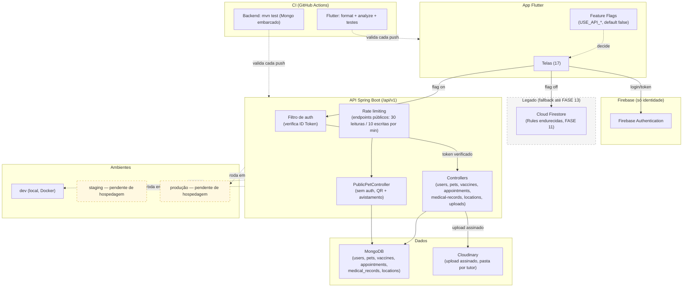

# Diagrama de Arquitetura — PetConnect (estado atual da migração)

> Substitui a visão implícita em `docs/arquitetura.md` (histórico,
> pré-migração). Este diagrama reflete o código real verificado em
> `docs/next-stage/` e `docs/migration/`.

## Legenda

- **Legado (cinza, tracejado)**: Firestore continua ativo como rede de
  segurança para as features cuja flag ainda está desligada, e para os
  18 usuários reais que ainda não migraram pro app novo. Não será
  removido nesta etapa (FASE 13 é posterior e depende de validação real).
- **Ambientes staging/produção (amarelo, tracejado)**: hospedagem ainda
  não decidida — ver `docs/next-stage/02-infrastructure-decision.md`.
  Hoje, tudo roda em `dev` (Docker local).
- **CI**: verificado rodando de verdade no GitHub Actions nesta etapa
  (não é aspiracional) — ver `docs/next-stage/03-ci-quality-gates.md`.
- O app nunca acessa o MongoDB diretamente — só via a API, sempre.
