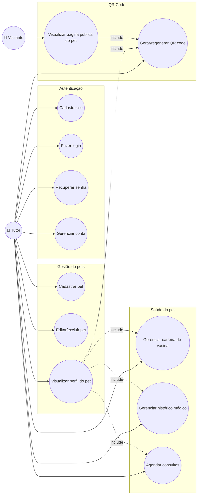

# Diagrama de Caso de Uso — PetConnect

> ⚠️ **Legado**: representa os casos de uso na visão original (Firestore
> direto), anterior à migração. Continua válido do ponto de vista de
> **produto** (os casos de uso do tutor não mudaram) — o que mudou é só
> o backend por trás. Não inclui os fluxos novos da migração (upload
> assinado, avistamento público com rate limiting) — ver
> `docs/diagramas/arquitetura.md` pra a visão técnica atualizada.

Mermaid não tem um tipo nativo de diagrama de caso de uso UML, então representamos com um `graph` (atores nas pontas, casos de uso como nós arredondados).

## Descrição dos atores

- **Tutor**: usuário autenticado, dono de um ou mais pets. Acessa todas as funcionalidades de gestão.
- **Visitante**: qualquer pessoa que encontre um pet e escaneie seu QR code — não precisa de conta nem login. Acesso restrito à página pública (RF17/RF18).

## Casos de uso principais

| Caso de uso | Ator | RF relacionado |
|---|---|---|
| Cadastrar-se | Tutor | RF01–RF03 |
| Fazer login (e-mail, Google ou Facebook) | Tutor | RF04, RF04-A, RF04-B, RF06 |
| Recuperar senha | Tutor | RF05 |
| Gerenciar conta | Tutor | RF08, RF09 |
| Cadastrar pet | Tutor | RF10 |
| Editar/excluir pet | Tutor | RF13, RF14 |
| Visualizar perfil do pet | Tutor | RF15 |
| Gerar/regenerar QR code | Tutor | RF16, RF19 |
| Visualizar página pública do pet | Visitante | RF17, RF18 |
| Gerenciar carteira de vacina | Tutor | RF20–RF23 |
| Gerenciar histórico médico | Tutor | RF24–RF26 |
| Agendar consultas | Tutor | RF27–RF30 |
