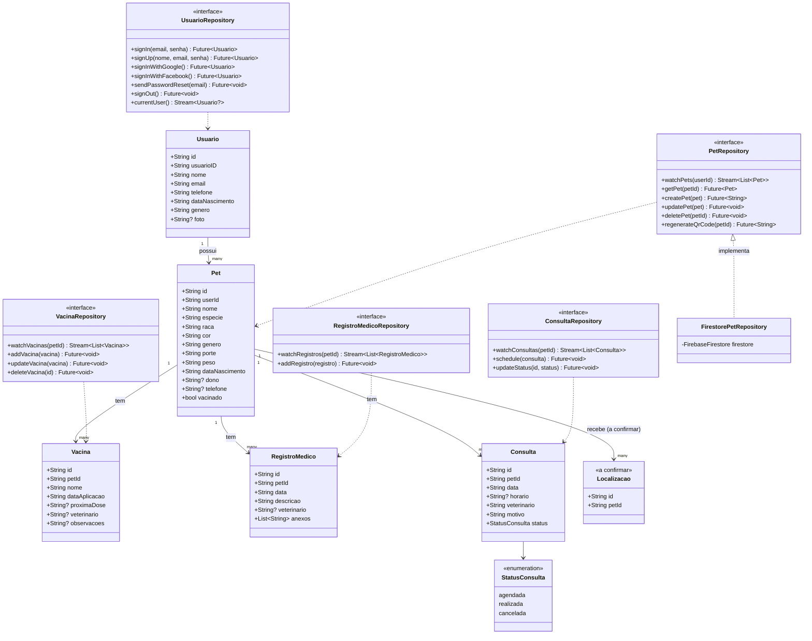

# Diagrama de Classes — PetConnect

> ⚠️ **Legado**: reflete o modelo do **Firestore** (nomes de campo em
> português, coleções `Usuarios`/`Pets`). O schema real do MongoDB (que
> a API usa) tem nomes em inglês e campos adicionais (`publicId`,
> `legacyFirestoreId`, `vaccinatedFlag`, etc.) — ver
> `docs/database/mongodb-target-schema.md` para o schema atual, e
> `docs/validation/rf01-rf32-parity.md` para o mapeamento campo a campo
> confirmado entre os dois modelos.

Atualizado para refletir a estrutura real do Firestore já existente (`docs/modelo-dados-firestore.md`) — nomes de classe e campo em português, alinhados às coleções `Usuarios` e `Pets`.

## Notas

- `Usuario.id` é o UID do Firebase Auth (mesmo valor do `docId` em `Usuarios`); `usuarioID` é um campo separado (UUID) já existente no banco — uso ainda a confirmar (ver `docs/modelo-dados-firestore.md`).
- `Pet.dono` existe no banco real mas sua função é redundante com `userId` — mantido no modelo até confirmação, não usado nas regras de negócio por enquanto.
- `Pet.vacinado` é o campo simples adicionado nesta fase. `Vacina` (subcoleção) é a proposta de histórico detalhado, ainda não implementada no banco.
- `Localizacao` entra como classe provisória — estrutura real pendente de confirmação.
- Datas são `String` (formato `dd/MM/yyyy`), seguindo a convenção já usada no banco existente, não `DateTime`/`Timestamp` nativos.
- Repositórios são interfaces (`abstract class` em Dart) na camada `domain`, implementadas na camada `data` com Firestore.
