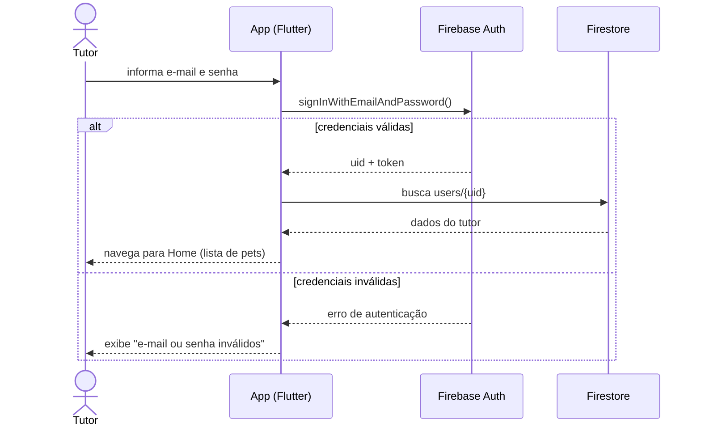
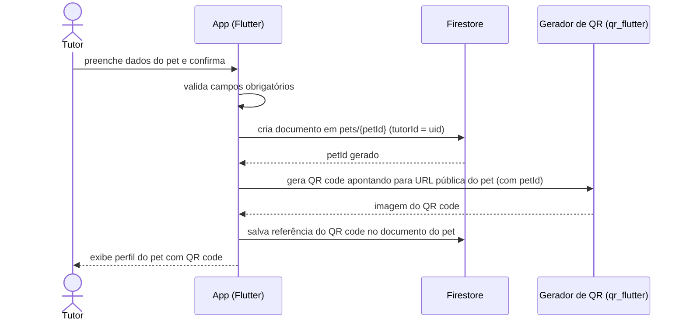
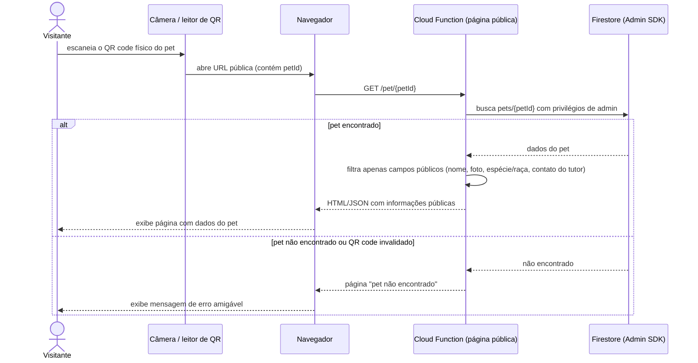

# Diagramas de Sequência — PetConnect

> ⚠️ **Legado**: as sequências abaixo mostram o app falando direto com
> o Firestore — válido só para quando as feature flags (`USE_API_*`)
> estão desligadas. Com a flag ligada, o passo "Firestore" abaixo é
> substituído por "API Spring Boot → MongoDB" (ver
> `docs/diagramas/arquitetura.md`); a sequência de interação (usuário →
> tela → repositório) não muda, só o que está atrás do repositório.

## 1. Login do tutor (RF04, RF06)

## 2. Cadastro de pet e geração de QR code (RF10, RF16)

## 3. Visitante escaneia o QR code (RF17, RF18)

